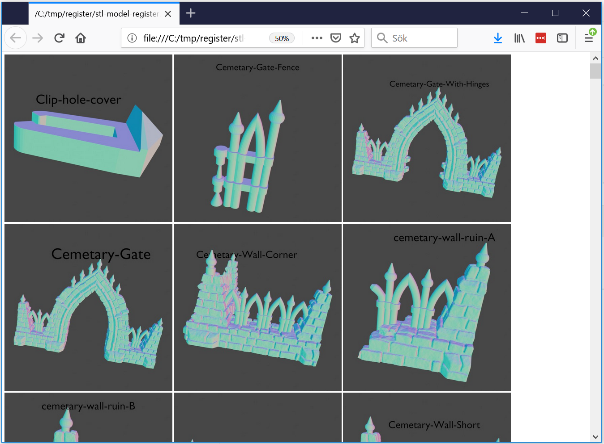

# stl-librarian
Generate a register with images of all stl-files in a folder. One image for each model and it's name will be rendered. An html-file will be created with image tags for all images.

## Usage

1. Download the blend-file from latest release. Python script is already loaded.
1. Open the blend-file in blender 2.8.
1. You should see a text file at the bottom. Edit the path at the top of the file.
1. source_dir should point to the directory where your STL-files are stored
1. target_dir should point to an existing directory where the images and html-file will be stored, a temp-dir is suggested
1. Enable "System console" in the System menu. 
1. Click run script
1. Wait, this will take some time. Monitor the progress in the console.
1. Inspect the result in the target dir.

## Function

The blend file contains a camera and two materials. One material that mimics a matcap material is the the model rendered.
The other material is for the text label.

The python script in the repository is not really used. It is only there to see changes in it.

### For each stl-file

A stl-file is loaded and the matcap material is loaded. It's origin is set to the center of the object.

A text object is created and gets text content as the name of the model file. It also gets the text label material.
The text object has it's origin set to center and is then positioned above the model object. It's rotation is set to match the camera so that it will be visible.

The 3D diagonal of the model object and text label dimensions are compared and the label is scaled to match the model.

The camera gets a bit narrower FOV and is set to focus on the two selected objects (model and label). Then the original FOV is restored. This is a quick and easy zoom out.

The scene is rendered to an image with the name of the model loaded.

Name of model is saved to a list.

Finally both the model object and label is deleted.

### Generate html-file

This is very simple. Loop over all the names of the models. Create a very simple html-file and add image tags for all models.

